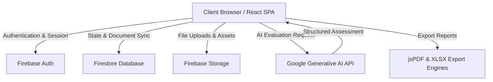

# Bavly-Hamdy/BIS-Smart-Grader-V2

[](https://www.typescriptlang.org/)
[](https://react.dev/)
[](https://tailwindcss.com/)
[](https://firebase.google.com/)
[](https://ai.google.com/)
[](https://opensource.org/licenses/MIT)

> An enterprise-grade, AI-powered automated assessment and grading platform architected for Business Information Systems (BIS) curriculums, integrating Google Gemini AI and Firebase for robust student evaluations.


---

## 📋 Table of Contents
1. [🏷️ Hero Header](#-hero-header)
2. [📋 Table of Contents](#-table-of-contents)
3. [🔍 Overview & Architectural Intent](#-overview-architectural-intent)
4. [📌 Architecture & Workflow](#-architecture--workflow)
5. [✨ Core Features & Capabilities](#-core-features--capabilities)
6. [🛠️ Technologies & Ecosystem Matrix](#-technologies--ecosystem-matrix)
7. [📋 Requirements & 🚀 Installation Guide](#-requirements--installation-guide)
8. [📁 Project Structure](#-project-structure)
9. [🧩 Main Modules & Technical Breakdown](#-main-modules--technical-breakdown)
10. [🖥️ CLI & Script Execution Matrix](#-cli--script-execution-matrix)
11. [🛡️ Security & Configuration Isolation](#-security--configuration-isolation)
12. [🚀 Deployment & Environment Matrix](#-deployment--environment-matrix)
13. [👥 Authors & Contributors](#-authors--contributors)
14. [🤝 Contributing](#-contributing)
15. [📄 License](#-license)

---

## 🔍 Overview & Architectural Intent

**BIS-Smart-Grader-V2** is built to solve high-volume academic grading bottlenecks within enterprise educational ecosystems. Modern Business Information Systems curriculums demand rigorous evaluation of both structured data analysis and subjective written responses, creating a massive administrative burden on faculty. 

This platform addresses this challenge by combining a responsive React single-page application (SPA) with serverless Firebase infrastructure and Google’s Gemini Generative AI models (`@google/generative-ai`). The architecture separates presentation logic from asynchronous AI evaluation streams, guaranteeing non-blocking user experiences while processing complex student assessments. State management relies on custom React Context providers coupled with reactive Firestore data bindings, allowing real-time synchronization of student grades, course rosters, and exam analytics across educator dashboards.

---

## 📌 Architecture & Workflow

The platform follows a modular, component-driven client architecture communicating directly with secure Firebase backend services and Google Generative AI REST endpoints.

### Progression Flow Diagram
```
[ Educator Uploads Exam Submissions ]
                 │
                 ▼
[ Bulk Upload Modal & File Parser (XLSX / PDF) ]
                 │
                 ▼
[ Firebase Storage & Firestore persistence Layer ]
                 │
                 ▼
[ Gemini AI Grading Engine (`geminiGradingService.ts`) ]
                 │
                 ├──────────────────────────────┐
                 ▼                              ▼
    [ Structured Rubric Matching ]    [ Qualitative Feedback Generation ]
                 │                              │
                 └──────────────┬───────────────┘
                                ▼
         [ Grade Analytics & PDF Export (`exportService.ts`) ]
```

### System Architecture Flowchart


### Architectural Decision Records (ADRs) & Trade-Offs

| Decision Point | Chosen Approach | Alternative Considered | Rationale |
| :--- | :--- | :--- | :--- |
| **Frontend Framework** | React 18 + Vite | Next.js / SSR | SPA architecture enables rapid deployment to static hosting (Firebase Hosting / GitHub Pages) while maintaining client-side caching. |
| **AI Integration** | Client-to-Gemini SDK Service | Dedicated Backend Microservice | Reduces infrastructure operational overhead for institutional deployments while leveraging Google's secure API keys. |
| **Database & Auth** | Firebase (Firestore & Auth) | Custom Node/PostgreSQL | Provides instantaneous real-time sync, robust security rule enforcement, and minimal maintenance overhead for academic institutions. |
| **Styling Engine** | Tailwind CSS v3 | CSS Modules / SCSS | Accelerated UI development with utility-first consistency and built-in support for responsive academic dashboards. |

---

## ✨ Core Features & Capabilities

* **AI-Driven Automated Grading**: Leverages Google Generative AI to evaluate student submissions against predefined rubrics with fine-grained qualitative feedback.
* **Comprehensive Course Management**: Intuitive administration interfaces for managing BIS course catalogs, semester cohorts, and faculty assignments.
* **Advanced Exam & Assessment Builder**: Dynamic exam creation tools supporting multiple-choice, essay, and analytical problem sets.
* **Real-Time Grade Analytics**: Visualized performance metrics powered by Recharts, offering deep insights into cohort grade distributions.
* **Enterprise Reporting & Exporting**: Seamlessly export verified grade sheets and student performance breakdowns to PDF (via `jspdf` and `jspdf-autotable`) and Excel (`xlsx`).
* **Multi-Language & Accessibility Support**: Built-in context providers for localized interfaces and accessibility compliance (high contrast and reduced motion modes).

---

## 🛠️ Technologies & Ecosystem Matrix

| Dependency | Version | Category | Purpose |
| :--- | :--- | :--- | :--- |
| `react` | ^18.2.0 | Framework | Core UI component rendering library |
| `react-dom` | ^18.2.0 | Framework | DOM reconciliation and rendering bindings |
| `firebase` | ^10.12.0 | Backend / DB | Authentication, Firestore database, and Cloud Storage |
| `@google/generative-ai` | ^0.24.1 | AI / LLM | Automated grading and rubric evaluation engine |
| `react-router-dom` | ^6.22.3 | Routing | Client-side navigation and protected route wrappers |
| `recharts` | ^2.12.3 | Visualization | Analytics charts and cohort performance graphs |
| `jspdf` & `jspdf-autotable` | ^3.0.4 / ^5.0.2 | Export | Client-side PDF generation and structured grade tables |
| `xlsx` | ^0.18.5 | Data Parsing | Excel spreadsheet parsing for bulk student uploads |
| `framer-motion` | ^11.0.24 | Animation | Fluid UI transitions and dashboard micro-interactions |
| `lucide-react` | ^0.368.0 | Icons | Enterprise iconography set |
| `tailwindcss` | ^3.4.17 | Styling | Utility-first CSS styling framework |
| `typescript` | ^5.0.0 | Language | Static typing and interface contracts |

---

## 📋 Requirements & 🚀 Installation Guide

### Prerequisites
* **Node.js**: Version 18.x or higher LTS
* **npm**: Version 9.x or higher
* **Firebase Project**: Configured project with Authentication and Firestore enabled

### Installation Steps

1. **Clone the repository**:
   ```bash
   git clone https://github.com/Bavly-Hamdy/BIS-Smart-Grader-V2.git
   cd BIS-Smart-Grader-V2
   ```

2. **Install dependencies**:
   ```bash
   npm install
   ```

3. **Configure environment variables**:
   Create a `.env` file in the root directory based on `.env.example`:
   ```env
   VITE_FIREBASE_API_KEY=your_firebase_api_key
   VITE_FIREBASE_AUTH_DOMAIN=your_firebase_auth_domain
   VITE_FIREBASE_PROJECT_ID=your_firebase_project_id
   VITE_FIREBASE_STORAGE_BUCKET=your_firebase_storage_bucket
   VITE_FIREBASE_MESSAGING_SENDER_ID=your_firebase_messaging_sender_id
   VITE_FIREBASE_APP_ID=your_firebase_app_id
   VITE_GEMINI_API_KEY=your_google_gemini_api_key
   ```

4. **Run the development server**:
   ```bash
   npm run dev
   ```

---

## 📁 Project Structure

```text
Bavly-Hamdy/BIS-Smart-Grader-V2/
├── .env.example
├── .firebaserc
├── .gitignore
├── App.tsx
├── README.md
├── components/
│   ├── AuthPage.tsx
│   ├── Button.tsx
│   ├── Dashboard/
│   │   ├── CourseCard.tsx
│   │   ├── CourseDetail.tsx
│   │   ├── CourseManagement.tsx
│   │   ├── DashboardHome.tsx
│   │   ├── DashboardLayout.tsx
│   │   ├── ExamCard.tsx
│   │   ├── ExamDetail.tsx
│   │   ├── ExamManagement.tsx
│   │   ├── GradeAnalytics.tsx
│   │   ├── GradeSheet.tsx
│   │   ├── ProfilePage.tsx
│   │   ├── SettingsPage.tsx
│   │   ├── StudentDetail.tsx
│   │   ├── StudentList.tsx
│   │   └── modals/
│   │       ├── BulkUploadModal.tsx
│   │       ├── CreateExamModal.tsx
│   │       ├── EditCourseModal.tsx
│   │       ├── GradeDetailModal.tsx
│   │   └── ...
│   ├── DemoSection.tsx
│   ├── ErrorBoundary.tsx
│   ├── Hero.tsx
│   ├── LandingPage.tsx
│   ├── Navbar.tsx
│   ├── NewsCard.tsx
│   ├── RequireAuth.tsx
│   └── ScrollToTop.tsx
├── context/
│   ├── LanguageContext.tsx
│   ├── ThemeContext.tsx
│   └── ToastContext.tsx
├── firebase/
│   └── firebaseConfig.ts
├── firebase.json
├── firestore.rules
├── index.css
├── index.html
├── index.tsx
├── package.json
├── postcss.config.js
├── public/
│   └── logo-icon.png
├── services/
│   ├── cloudinaryService.ts
│   ├── courseService.ts
│   ├── exportService.ts
│   ├── geminiGradingService.ts
│   └── notificationService.ts
├── tailwind.config.js
├── tsconfig.json
├── types.ts
└── utils/
    ├── bisCurriculum.ts
    └── vite-env.d.ts
```

---

## 🧩 Main Modules & Technical Breakdown

### Core Configuration & Application Shell
* **`README.md`**: Provides the comprehensive system documentation, architecture overview, and deployment guidelines.
* **`firebase.json`**: Configures Firebase project parameters, hosting distribution directories, and Firestore security rule bindings.
* **`index.html`**: The root HTML shell, loading Google Fonts, establishing viewport settings, and mounting the React application root.
* **`index.tsx`**: The main React DOM bootstrap file that mounts `<App />` within strict mode and wraps global providers.
* **`index.css`**: Defines global Tailwind directives, custom scrollbar utilities, high-contrast/reduced-motion modes, and Arabic font fallbacks.

### Backend & Services
* **`firebase/firebaseConfig.ts`**: Initializes the Firebase app instance using environment variables and exports authenticated Firebase services (`auth`, `db`, `storage`).
* **`services/geminiGradingService.ts`**: Connects to the Google Generative AI API to evaluate student exam responses against instructor-defined rubrics.
* **`services/courseService.ts`**: Manages CRUD operations for courses, exams, and student grades within Firestore.
* **`services/exportService.ts`**: Implements client-side report generation, transforming raw grading data into formatted PDF and Excel documents.
* **`services/cloudinaryService.ts`**: Handles media and document asset uploads to external cloud storage.

### Styling & Build Tooling
* **`package.json`**: Declares project scripts, dependencies, devDependencies, and GitHub Pages publishing targets.
* **`tailwind.config.js`**: Extends the Tailwind design system with custom academic color palettes, dark mode variants, and typography scales.
* **`postcss.config.js`**: Configures PostCSS with Tailwind CSS and Autoprefixer for cross-browser style compilation.

---

## 🖥️ CLI & Script Execution Matrix

The following scripts are defined in `package.json` and can be executed via npm:

| Command | Action | Description |
| :--- | :--- | :--- |
| `npm run dev` | Development | Starts the Vite local development server with HMR |
| `npm run build` | Production Build | Compiles and bundles TypeScript and React assets into `dist/` |
| `npm run preview` | Local Preview | Serves the production build locally for verification |
| `npm run deploy` | Deployment | Automatically builds and pushes the `dist/` directory to GitHub Pages via `gh-pages` |

---

## 🛡️ Security & Configuration Isolation

* **Environment Variable Protection**: All API keys (Firebase and Google Gemini) are isolated using Vite's `VITE_` prefix, preventing sensitive secrets from leaking into client-side application bundles.
* **Firestore Security Rules**: Database access is restricted via `firestore.rules`, ensuring only authenticated faculty and authorized institutional accounts can read or write course grades.
* **Route Protection**: `<RequireAuth>` component wrappers enforce strict authentication checks on all dashboard and administrative routes.

---

## 🚀 Deployment & Environment Matrix

The application supports continuous deployment pipelines targeting static hosting providers:

| Environment | Build Command | Output Directory | Target Platform |
| :--- | :--- | :--- | :--- |
| **Development** | `npm run dev` | In-Memory (Vite Dev Server) | Localhost (`http://localhost:5173`) |
| **Staging / Production** | `npm run build` | `dist/` | Firebase Hosting / GitHub Pages |

To deploy to GitHub Pages:
```bash
npm run deploy
```

---

## 👥 Authors & Contributors

* **Bavly Hamdy** - *Lead Architect & Maintainer* - [Bavly-Hamdy](https://github.com/Bavly-Hamdy)
* **Community Contributors** - Enterprise academic and engineering contributors.

---

## 🤝 Contributing

Contributions are warmly welcomed! To ensure a smooth workflow for all contributors, please follow these guidelines:

### 1. Reporting Bugs & Issues
* Use the GitHub [Issues](https://github.com/Bavly-Hamdy/BIS-Smart-Grader-V2/issues) tab to report bugs or request features.
* Include clear steps to reproduce, expected behavior, environment details, and relevant console logs or screenshots.

### 2. Submitting Pull Requests (PRs)
1. Fork the repository and create your feature branch from `main`:
   ```bash
   git checkout -b feature/your-feature-name
   ```
2. Commit your changes following conventional commit messages (e.g., `feat(grading): add custom rubric weights`).
3. Ensure your code passes all TypeScript checks and builds cleanly without warnings:
   ```bash
   npm run build
   ```
4. Push to your fork and submit a Pull Request targeting the `main` branch with a comprehensive description of your changes.

### 3. Code Style & Standards
* **TypeScript**: Strict typing is enforced across all components and services. Avoid using `any` type definitions.
* **Linting & Formatting**: Follow existing React component patterns, utilizing Tailwind CSS for styling and maintaining modular separation between services and UI components.

---

## 📄 License

This project is licensed under the **MIT License**. See the [LICENSE](LICENSE) file for details.

---
© 2026 Bavly-Hamdy. All rights reserved.